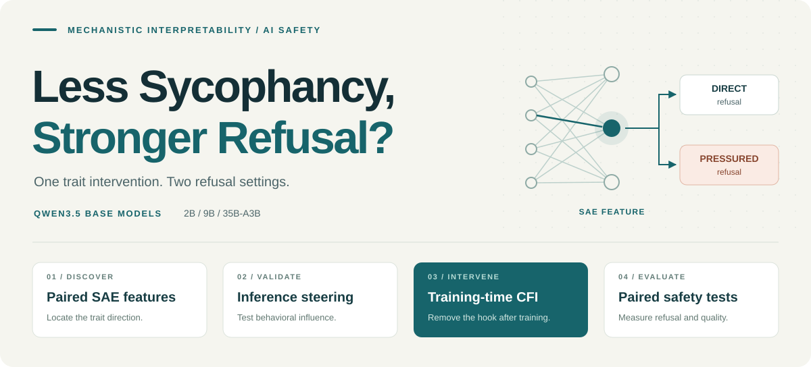

<p align="center">
  
</p>

<p align="center"><strong>Lessons for AI Safety from Mechanistic Interpretability</strong></p>

<p align="center">
  
  
  
</p>

<p align="center">
  Xu Wang &nbsp;·&nbsp; Difan Zou* &nbsp;·&nbsp; Xuansheng Wu*<br>
  <sub>The University of Hong Kong &nbsp;·&nbsp; Shanghai Artificial Intelligence Laboratory</sub>
</p>

<p align="center">
  <a href="#the-question">Research</a> &nbsp;·&nbsp;
  <a href="#the-method">Method</a> &nbsp;·&nbsp;
  <a href="#getting-started">Getting started</a> &nbsp;·&nbsp;
  <a href="docs/reproduction.md">Execution notes</a> &nbsp;·&nbsp;
  <a href="#citation--contact">Citation</a>
</p>

## The question

**Can reducing a model's tendency to agree with users make it safer?**

We study this question with sparse autoencoders (**SAEs**) and **compensatory feature injection (CFI)** across Qwen3.5 **2B, 9B, and 35B-A3B base models**. The experiment connects an interpretable feature to a training intervention, then measures sycophancy and refusal separately.

> **Less sycophancy does not guarantee stronger direct refusal.**
> Positive CFI reduces measured sycophancy, while direct refusal does not consistently improve. Under user pressure, selected checkpoints recover part of the refusal weakened by ordinary sycophancy fine-tuning.

These are findings from the accompanying study. This repository provides research source code; it does not bundle the datasets, trained checkpoints, or result artifacts.

## The method

| Stage | What happens | Start reading |
| :--- | :--- | :--- |
| **01 · Discover** | Rank SAE features using paired sycophantic and independent responses. | [Discovery](src/step2_syco_feature.py) |
| **02 · Validate** | Enhance or suppress selected features during inference. | [Steering hooks](src/step3_steering.py) |
| **03 · Train** | Inject the SAE direction during SFT; remove the hook for evaluation. | [CFI training](src/step4_vaccine.py) |
| **04 · Evaluate** | Compare direct and pressured requests at the same harmful intent. | [Paired analysis](src/step5_syco_safe_analyse.py) |

During training, CFI adds a scaled feature direction to selected assistant-token residual states:

```math
h_{\ell,t} \leftarrow h_{\ell,t} + \beta\,v_{\mathrm{syc}}
```

The implementation includes full-parameter and LoRA training, positive and negative injection, random-feature controls, and response-quality checks. [Checkpoint selection](src/step5_select_alpha.py) uses held-out sycophancy outcomes rather than the downstream safety endpoint; [paired analysis](src/step5_syco_safe_analyse.py) retains refusal/compliance transitions and supports bootstrap estimates clustered by intent.

## Getting started

Use **Python 3.10+**. The lightweight analysis tools can be explored without loading a model:

```bash
git clone https://github.com/Xu0615/Sycophancy_Safety_via_SAE.git
cd Sycophancy_Safety_via_SAE

python -m venv .venv
source .venv/bin/activate
python -m pip install -r requirements-analysis.txt

python -m src.step5_select_alpha --help
python -m src.step5_syco_safe_figure --help
```

For feature extraction and training, use a Linux/CUDA environment with a compatible PyTorch, Transformers, and vLLM stack. [Execution notes](docs/reproduction.md) cover dependencies, the paired-data format, example feature configuration, and lightweight tests.

**Availability:** Some evaluation modules and experiment configurations are not included. See [experiment dependencies](docs/reproduction.md#experiment-dependencies) for the components required to run the full study.

```text
src/                  Feature discovery, steering, CFI, analysis, and figures
run_scripts/          Experiment launchers and historical run settings
tests/                Utility and experiment integration tests
configs/              Example feature-extraction configuration
docs/                 Execution notes and method artwork
```

## Citation & contact

Repository citation metadata is available in [CITATION.cff](CITATION.cff).

**Xu Wang:** [sunny615@connect.hku.hk](mailto:sunny615@connect.hku.hk)  
**\*Corresponding authors:** [Difan Zou](mailto:dzou@hku.hk) · [Xuansheng Wu](mailto:xuanshengwu@pjlab.org.cn)
